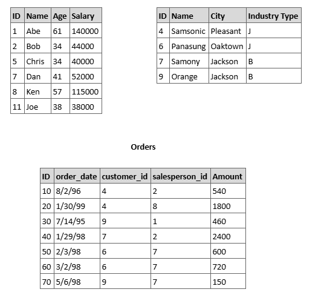

# Writting the SQL query

Given the tables above, write the SQL query that:

a. Returns the names of all Salesperson that don’t have any order with Samsonic.

b. Updates the names of Salesperson that have 2 or more orders. It’s necessary to add an ‘*’ in the end of the name.

c. Deletes all Ssalesperson that placed orders to the city of Jackson.

d. The total sales amount for each Salesperson. If the salesperson hasn’t sold anything, show zero.
